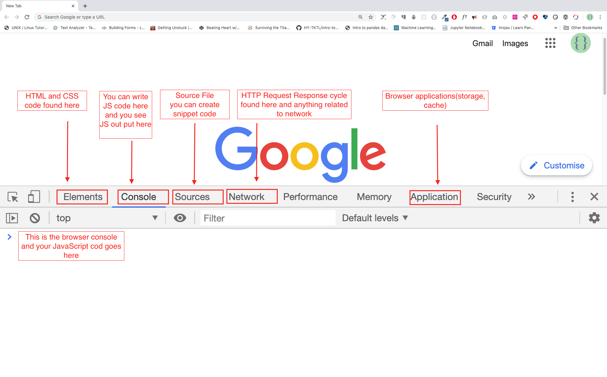

# Js/Ts Syntax Reference (and mainly how to transtion from python)

Sources:

- 30 days of Javascript
- The Typescript official documentation and handbook
- Odin project
- MDN Docs
= Learnxinyminutes, for both Js and Ts

> [!note] jsx and js
> jsx is just javascript with xml, and its a syntax extension for js that lets you write html like code in your js files. Most common as a react thing.

## 0a. Orientation (Initialization : Node, Chrome and WSL)

1. run installer for Node → [node.js](https://nodejs.org/en/). → after installation / if unsure of latest version, check with cmd → `node -v`
    - used for managing js packages, like python pip
2. Using Chrome web-inspect tools
    - open web-inspect console : new tab page → ⋮ (triple-dot) → more tools → developer tools
        - Keyboard shortcuts: (mac, just swap ctrl with command)

        | open Devtools in elements panel | ctrl + shift + C |
        | --- | --- |
        |  **open Devtools in console panel**  | ctrl + shift + J |
        | opens last-used panel in Devtools | ctrl + shift + I |
        | hard reload together with cache | ctrl + shift + R |
        | (Mobile)Device Mode toggle | ctrl + shift + M |

3. VS Code → for development, refer to [VS Code shortcuts](https://code.visualstudio.com/shortcuts/keyboard-shortcuts-windows.pdf)
    - alt + b in vs code to just open html script in browser.

### 0b. Injecting script

3 ways:

- Inline script (with html tag event-based attributes like `onclick` from `button`)

    write together with your html :

    ```html
    <button onclick="alert('Welcome to 30DaysOfJavaScript!')">Click Me</button>
    ```

- Internal script ( with`<script> </script>` from html)

    wrap code in script tags (usually inside body tags):

    ```html
    <head>
    <title>30DaysOfScript:Internal Script</title>
    </head>
    <script>
     console.log('Welcome to 30DaysOfJavaScript')
    </script>
    
    ```

    > [!note] Do not indicate the attribute `type="text/javascript"`
    > its just a html5 standard thing, but this is an unnecessary type to declare for newer browsers since its redundant and assumed.

- External script (s)

    link to javascript files using `src` attribute under `script`

    ```html
    <!DOCTYPE html>
    <html lang="en">
      <head>
        <title>30DaysOfJavaScript:External script</title>
        <script src="introduction.js"></script>
      </head>
      <body></body>
    </html>
    ```

    - files just direct to filepath.

---

### 1. Commenting and documentation conventions

- `//` ⇒ for single-line Comments
- For multi-line comments, just start as `/*` , end with `*/`.

```jsx
// Child-stealer
/* 
Desc: steals children
Params: Children, number, region
*/
```

### 1b. Terminating statements → `;`

- terminate statements with `;`:

    ```jsx
    // Statements can be terminated by ;
    doStuff();
    ```

    its just good pratice to do so, but they still work otherwise. see asynchronous functions for why you should still do it anyway.

---

### 2. Printing to console → `console.log('print_text')`

- equivalent to `print()` in python, just writes something out in the console when executed.
- accepts comma separated args and iterables, **concatenates with spaces** and prints them ie `console.log("hi","dingus")` ⇒ console prints > `hi dingus`
- primitive vs non-primitive / reference types: type mutability
    - primitive datatypes → types themselves cant be modified once created → they are immutable
        - ie strings cant be modified
    - non-primitive datatypes → types that can be updated even after theyve been assigned (mutable). (are also commonly known as reference types)
        - different from python, you cant modify a string once its assigned ie you cant do `word[0] = “y”` because thats something only non-primitives can do.
        - do not use non-primitive datatypes for comparison.
    - **Dont confuse for static vs dynamic typing.**
        - Static vs dynamic typing → relates to variable types, whether data type is mutable
        - primitive vs non-primitive typing → relates to values themselves, whether you need to enter an wholly new value to update it, or you can amend
    - Rule of Thumb: Don’t use non-primitive types for boolean comparisons.
        - confusing when you have 2 arrays that refer to 2 diff entities, but have the same value at each slot.

### 2a. getting user input

- done with `window.prompt()`

---

### 3. **Primitive Data Types (`Number, String, Bool, Null, Undefined, Symbol`)**

JS is dynamically typed, so its ok you can anyhow assign your variables. below are the most common types you need to identify:

- `Number` → integers and Floating point numbers
    - integers → [-2¹⁰²⁴ —  2¹⁰²⁴ ], otherwise you get `infinity`
    - alt: `BigInt` → for integers that are huge and only arbitrary precision is required
- `String` (ie `'a'`)
    - wrap with `'`, `` ` `` or `"` , no difference
- `Boolean` ⇒ `true` or `false`
- `undefined` ⇒ by default what type variables are, if nothing’s assigned yet.
    - same with functions if they don’t return anything, ie:

    ```jsx
     let firstName
     console.log(firstName) 
     // undefined, because it is not assigned to a value yet
    ```

- `null` ⇒ if you want to make sure your value has the “empty” value.
    - ie `let emptyValue = null`

    `null` ([docs](https://developer.mozilla.org/en-US/docs/Glossary/Null)) vs `Undefined` ([docs](https://developer.mozilla.org/en-US/docs/Glossary/Undefined))

    - `undefined` means the variable just has no declared type yet.
        - auto-assigned to variables that are declared as is.
    - `null` means variable has a value, and that value is just null or just basically is a pointer that points to nothing / an address that doesn’t exist.
        - intentionally represents a value that doesnt exist, to distinguish between unset and set variables.
        - actually, returning object from typeof is **considered a bug**.

- `Symbol` ⇒ just act as special tokens with UIDs.
    - sample code:

        ```jsx
        // Creating some arrays
        const Array1 = [1, 2, 3];
        const Array2 = [4, 5, 6];
          
        // Calling concat() function
        let Array3 = Array1.concat(Array2);
          
        // Printing the concatenated array
        console.log(Array3);
          
        // Calling Symbol.isConcatSpreadable symbol
        Array2[Symbol.isConcatSpreadable] = false;
        Array3 = Array1.concat(Array2);
          
        // Printing the concatenated array
        // after calling of Symbol.isConcatSpreadable symbol
        console.log(Array3);
        
        `CONSOLE OUTPUT:
        Array [1, 2, 3, 4, 5, 6]
        Array [1, 2, 3, Array [4, 5, 6]]
        `
        ```

    - for now just remember that even if 2 vars are assigned the exact same thing ie:

    ```jsx
    let symboll = Symbol('synbol2');
    let symbol2 = Symbol('symbol2');
    console, Log(symboll === symbol2); // returns false
    console. log(typeof symboll);      // returns false
    `they will still never be the same thing.`
    ```

    - also throws an exception when converting Symbol to string, unless you use the `.toString()` method.
- `object` ⇒ created by doing `var = {}`

💡 **use `typeof <varname>` to figure out datatypes.**

- note that for `null`, `console.log(typeof <var>)` will return `object`. (not as in oh the variable is unitialized, it literally returns that as a string)
- undefined returns as `undefined`.

### weird interactions between types

(From [Javascript.info](https://javascript.info/operators#string-concatenation-with-binary))

- For strings and the '+' operator, processing occurs from left to right:
    - printing `2+2+'1'` &#8212; 2 + 2 = 4 first, then concat "1"
    - printing `'1'+2+2` &#8212; treats '1'+2 as '12' then continues as '122'
- For other operators, they will convert the result to numbers regardless of the operand type (string or number).

- Unary + and 0: adding a '+' before a non-number converts it into a number:
    - ie `+true` turns into 1 cuz it sounds true
    - ie `+""` turns into 0 because it evaluates to false
    - but if its already a number nothing happens ie. `x=-5;console.log(+x)` returns `-5`
    - strings that are numbers are turned into numbers ie `x='5'` turns into an integer if you do `+x` (same effect as doing `Number(x)`).

- `++` or `--` before / after the operator
    - prefix (`++counter`) &#8212; If we’d like to increase a value and immediately use the result of the operator
    - postfix (`counter++`) &#8212; means when variable is called (or instantaneously called), the value doesn't update until execution goes past that line.

---

### 4. **Math Operations (under math module)**

- refer to python for [mdn web docs](https://developer.mozilla.org/en-US/docs/Web/JavaScript/Reference/Operators/Operator_precedence#table) for order of operations.
    - reminder, exponent operation processes from right to left:

    `2**4**3**5 = 2**4**(3**5)=2**(4**243) = 2**3486784401`

    - additional note, large enough n, js returns output as `Infinity`.
        - happens when theres an overflow of values: numbers that are so big they overflow the buffer.
        - largest number handle-able is 2¹⁰²⁴ = 1.79e+308, so just make sure you don’t do math with numbers that are too big.
        - same with `-Infinity`. see integer storage for refresher.
    - `NaN` is what is returned for values that arent numbers or like what python throws as MathError, ie doing `0/0`.
    - sample code:

        ```jsx
        console.log(2 + 3) // Addition
        console.log(3 - 2) // Subtraction
        console.log(2 * 3) // Multiplication
        console.log(3 / 2) // Division
        console.log(3 % 2) // Modulus - finding remainder
        console.log(3 ** 2) // Exponentiation 3 ** 2 == 3 * 3
        2**3486784401
        `Output:
        5
        1
        6
        1.5
        1
        9
        Infinity
        `
        ```

    refer to the `Math` object for more methods. (full in cheatsheet):

    - sample code

        ```jsx
        const PI = Math.PI
        // Rounding to the closest number
        // if above .5 up if less 0.5 down rounding
        
        // estimation
        console.log(Math.round(PI))        // rounds to the nearest number
        console.log(Math.round(9.81))      // 10
        console.log(Math.floor(PI))        // 3 rounding down
        console.log(Math.ceil(PI))         // 4 rounding up
        
        //min and max
        console.log(Math.min(-5, 3, 20, 4, 5, 10)) // -5, returns min val
        console.log(Math.max(-5, 3, 20, 4, 5, 10)) // 20, returns max val
        
        //rng
        const randNum = Math.random() 
        // creates random number between 0 to 0.999999, up to 6 s.f.
        
        // rng_application: creates random number between 0 and 10
        const num = Math.floor(Math.random () * 11)
        console.log(num)
        
        //Absolute value
        console.log(Math.abs(-10))      // 1
        
        //Square root
        console.log(Math.sqrt(100))     // 10
        console.log(Math.sqrt(2))       // 1.4142135623730951
        
        // Power
        console.log(Math.pow(3, 2))     // 9
        console.log(Math.E)             // 2.718
        
        // Logarithm
        // Returns the natural logarithm with base E of x, Math.log(x)
        console.log(Math.log(2))        // 0.6931471805599453
        console.log(Math.log(10))       // 2.302585092994046
        
        // Returns the natural logarithm of 2 and 10 respectively
        console.log(Math.LN2)           // 0.6931471805599453
        console.log(Math.LN10)          // 2.302585092994046
        
        // Trigonometry
        Math.sin(0)
        Math.sin(60)
        Math.cos(0)
        Math.cos(60)
        ```

### 4.a Resolving operations with a Binary tree

If you are familiar with binary trees, think about it as a [post-order traversal](https://en.wikipedia.org/wiki/Tree_traversal#Post-order,_LRN).

```txt
                /
       ┌────────┴────────┐
echo("left", 4)         **
                ┌────────┴────────┐
        echo("middle", 3)  echo("right", 2)

```

After all operators have been properly grouped, the binary operators would form a binary tree. Evaluation starts from the outermost group — which is the operator with the lowest precedence (`/` in this case). The left operand of this operator is first evaluated, which may be composed of higher-precedence operators (such as a call expression `echo("left", 4)`). After the left operand has been evaluated, the right operand is evaluated in the same fashion. Therefore, all leaf nodes — the `echo()` calls — would be visited left-to-right, regardless of the precedence of operators joining them.

### 4.b Operator Short-circuiting (for stuff like logical and n or)

- like python where you can technically evaluate if you know the result of the left operand.

```jsx
a || (b * c); // evaluate `a` first, then produce `a` if `a` is "truthy"
a && (b < c); // evaluate `a` first, then produce `a` if `a` is "falsy"
a ?? (b || c); // evaluate `a` first, then produce `a` if `a` is not `null` and not `undefined`
a?.b.c; // evaluate `a` first, then produce `undefined` if `a` is `null` or `undefined`
```

right side will only be evaluated if left side there are cases that need it.

### 4.c Bitwise Operators

- For operations on binary inputs. Rare, but they exist.
    - Intro can be found under W3's JS operators under the "JavaScript Bitwise Operators".
    - Further documentation exists under [W3's docs](https://www.w3schools.com/js/js_bitwise.asp) on JS Bitwise Operations.
    - just be aware that JS stores its numbers as 64 bit floats, but all bitwise operations are performed on 32 bit binary numbers via conversion,and then converts it back into 64 bit numbers.

---

## 5. **Variables + naming convention (variables use `let`, constants use `const`, old way of naming variables use `var` )**

- Assignment can be done with `let`, `var` or `const`.
    - `let` → standard container creator, you can reassign anytime. Doesn’t allow for hositing.
    - `var` → predecessor of `let`, allows for hoisting, but just use `let` as the default.
        - works on the concept of **hoisting**; declaring variables like this in local scope will establish them as variables in the global scope.
        - bad because you wont be sure when you reassign values, ie and priority is sus if you redeclare variables with the same name but diff values, doesnt make sense so just use let.
        - ie code like this is allowed with var, but not let

            ```jsx
            var myName = "Chris";
            var myName = "Bob"
            // no error, but confusing cuz hoisting may choose the later one before the 
            // new one and thats confusing
            
            let myName = "Chris";
            let myName = "Bob";
            // not ok
            
            let myName = "Chris";
            myName = "Bob";
            // ideal
            ```

    - `const` → assigning vars like this means they can’t be reassigned, act like “constants”.
        - helps with making your code clean and understanable
- **Naming Convention**
    - Var names in JS should:
        - not begin with a number
        - not allow special charas, except for `$` and `_`
        - be in CamelCase. alternatively, underscoring is also ok.
            - CamelCase is more important when dealing with classes and objects.
            - note 2 diff types of camelcase, one that starts with caps (CamelWithTwoHump) and one that doesnt (camelWithOneHump)
        - have no spaces.
- you can also multiassign like this:

    ```jsx
    let name = 'Asabeneh', job = 'teacher', live = 'Finland'; // Ahh vba memories with Dim...yuck
    ```

- Hoisting (tldr, you can declare stuff after the section where your code needs it, and it’ll still work)
    - concerns `var`.
    - declaring vars with `var` drags your variables to the top, and intepreter will priorize scanning your code for variables declared this way before your script is actually run.
    - this concept also applies for `functions`, where you can call a function before its defined:

        ```jsx
        hello()
        function hello(){
         console.log("hi there!")
        }
        // Still outputs hi there!, as if theres nothing wrong here.
        ```

    - contrary to it being done like this:

        ```jsx
        hello()
        const hello = ()->{
         console.log("hi there!")
        }
        // will be cleared in order.
        ```

    - declaring is dragged up, but not assignment (for functions, vars both are). Just note.
    - basically fixes the problem of structuring, ie having functions that havent been defined called alr.
- `let` property: Temporal Dead zones (TDZ)
    - A variable declared with `let`, `const`, or `class` is said to be in a "temporal dead zone" (TDZ) from the start of the block until code execution reaches the place where the variable is declared and initialized.

    TLDR:

    - property of non-hoistable variables, is that if you try to access it before its declared, it returns ReferenceError.
    - cheem word just to make it sound cool.
- also note, you cant use let and declare a variablename that already exists.
- These keywords are also only used once at declaration, you don't need to reassign them.

### scoping

### 6. **Strings In Depth**

- Other than single and double quotes, you can also use backticks .

    ```jsx
    const string1 = "A string primitive";
    const string2 = 'Also a string primitive';
    const string3 = `Yet another string primitive`;
    
    // if you need to force type conversion
    const string4 = new String("A String object");
    ```

    - backtick strings act as template literals (the F-strings of python)
    given `var = "multi-line"` ⇒ ``which also facilitates ${var} strings``
        - naturally allows you to write multiline strings.
- strings can be concatonated with `+` .

    ```jsx
    let strA = 'foo';
    let strB = 'bar';
    let callSign = 'Rogue-';
    let sn= 1;
    
    let status = strA + strB ;// returns 'foobar'
    let Shipname = callSign + sn; // returns 'Rogue-1'
    // ES5 string addition, where numbers are auto-converted into 
    // string-format and returned together with concatonation
    ```

    - stick to using one way to note strings. (just use backticks, the superior string-noter)

### Multi-lining

- backticks to denote strings already allow you to multiline naturally.
- for quotes, use `\` at the end of each line to denote a new line.

    ```jsx
    const usingBackTicks = `foo
    bar`;
    const usingQuotes = 'foo\
    bar' // note 'foo\bar' just returns as is, doesnt break line.
    // '\' also isnt read in quotes, returns 'foobar'.
    ```

- you can use the other symbols inside each string, ie `"what's up"`
- but just note if you want to use the same as those you use to note your string, just use escape keys ie `'what\'s up'`
- denote each template literal variable’s with `${<var_name>}`.

    ```jsx
    let firstName = 'John';
    let lastName = 'Doe';
    const finalstr = `Hi! My first name is ${firstName} and my last name is ${lastName}!`
    ```

- [**] NOTE: Template literals are static once declared, so its not like you can update them after declaring them statically.

[Full documentation for strings in MDN found here.](https://developer.mozilla.org/en-US/docs/Web/JavaScript/Reference/Global_Objects/String)

### String Methods

[**String Methods (just read from w3schools, its cleaner):**](https://www.w3schools.com/js/js_string_methods.asp)

- note, multiplying strings by integers gives nothing, its not like python.
    - returns Nan, type number. (regardless of which datatype was declared first)
    - old docs

        - **String Methods (referencing how python does it):**
            - you can do `<str_var>.length` to get the length of your string, and like other languages, you can access each char in a string by index.
            - js also has a `<str_var>.toUpperCase()` function to convert all chars in your string into uppercase chars.
            - same with `<str_var>.toLowerCase()`
            - String Slicing also exists in js with the `<str_var>.substring(x,y)`, which returns the string from index x to y-1.
            - `.split()` also translates from python to here, except its a little weird, and not specifying a delimiter will just convert your string to an array with 1 element. you gotta specify, even if its an empty char like ````:
                - code

                    ```jsx
                    let string = '30 Days Of JavaScript'
                    
                    console.log(string.split())     
                    // Changes to an array -> ["30 Days Of JavaScript"]
                    console.log(string.split(' '))  
                    // Split to an array at space -> ["30", "Days", "Of", "JavaScript"]
                    
                    let firstName = 'Asabeneh'
                    
                    console.log(firstName.split())    
                    // Change to an array - > ["Asabeneh"]
                    console.log(firstName.split(''))  
                    // Split to an array at each letter ->  ["A", "s", "a", "b", "e", "n", "e", "h"]
                    
                    let countries = 'Finland, Sweden, Norway, Denmark, and Iceland'
                    
                    console.log(countries.split(','))  
                    // split to any array at comma -> ["Finland", " Sweden", " Norway", " Denmark", " and Iceland"]
                    // problem is that theres still spaces in each elem, q annoying.
                    console.log(countries.split(', ')) 
                    //  ["Finland", "Sweden", "Norway", "Denmark", "and Iceland"]
                    ```

            - also theres this problem with .split() if you have whitespace around your split stuff, so where in python we use `.strip()` just use `.trim():`
                - code

                    ```jsx
                    let string = '   30 Days Of JavaScript   '
                    
                    console.log(string)
                    console.log(string.trim(' '))
                    
                    let firstName = ' Asabeneh '
                    
                    console.log(firstName)
                    console.log(firstName.trim())  
                    // still removes spaces at the beginning and the end of the string
                    
                    /*OUTPUT
                    30 Days Of JavasCript   
                    30 Days Of JavasCript
                      Asabeneh 
                    Asabeneh
                    */
                    ```

            - instead of overloading `in` for collections in python, JS has a string-specific function called `.search()`:
                - remember that its also case-sensitive.
                - code

                    ```jsx
                    let string = '30 Days Of JavaScript'
                    
                    console.log(string.includes('Days'))     // true
                    console.log(string.includes('days'))     // false - it is case sensitive!
                    console.log(string.includes('Script'))   // true
                    console.log(string.includes('script'))   // false
                    console.log(string.includes('java'))     // false
                    console.log(string.includes('Java'))     // true
                    
                    let country = 'Finland'
                    
                    console.log(country.includes('fin'))     // false
                    console.log(country.includes('Fin'))     // true
                    console.log(country.includes('land'))    // true
                    console.log(country.includes('Land'))    // false
                    ```

            - `.replace(old,new)` also works as you’d imagine.
                - code

                    ```jsx
                    let string = '30 Days Of JavaScript'
                    console.log(string.replace('JavaScript', 'Python')) 
                    // 30 Days Of Python
                    let country = 'Finland'
                    console.log(country.replace('Fin', 'Noman'))
                    // Nomanland
                    ```

            - instead of `.find(<some char>)`, we have 3 versions:
                - `.charAt(index).` → for single characters in strings

                    ```jsx
                    let string = '30 Days Of JavaScript'
                    console.log(string.charAt(0))        // 3
                    
                    let lastIndex = string.length - 1
                    console.log(string.charAt(lastIndex)) // t
                    ```

                - `.charCodeAt(index).` → for getting the ascii codes for a character

                    ```jsx
                    let string = '30 Days Of JavaScript'
                    console.log(string.charCodeAt(3))        // D ASCII number is 68
                    
                    let lastIndex = string.length - 1
                    console.log(string.charCodeAt(lastIndex)) // t ASCII is 116
                    ```

                - `.indexOf(substring)` →  for seeing if a substring exists, and returning the index where its first found

                    ```jsx
                    let string = '30 Days Of JavaScript'
                    
                    console.log(string.indexOf('D'))          // 3
                    console.log(string.indexOf('Days'))       // 3
                    console.log(string.indexOf('days'))       // -1
                    console.log(string.indexOf('a'))          // 4
                    console.log(string.indexOf('JavaScript')) // 11
                    console.log(string.indexOf('Script'))     //15
                    console.log(string.indexOf('script'))     // -1
                    ```

                - `.lastIndexOf(substring)` ->checking the last seen index for a substring

                    ```jsx
                    let string = 'I love JavaScript. If you do not love JavaScript what else can you love.'
                    
                    console.log(string.lastIndexOf('love'))       // 67
                    console.log(string.lastIndexOf('you'))        // 63
                    console.log(string.lastIndexOf('JavaScript')) // 38
                    ```

                - `.concat(substring,substring)` → for concatting strings, but note it doesn’t auto-add spaces.

                    ```jsx
                    let string = '30'
                    console.log(string.concat("Days", "Of", "JavaScript"))
                    // 30DaysOfJavaScript
                    let country = 'Fin'
                    console.log(country.concat("land"))
                    // Finland
                    ```

                    -
                - `.startsWith(substring)`→ checks for an entire substring if its the start of the string

                    ```jsx
                    let string = 'Love is the best to in this world'
                    
                    console.log(string.startsWith('Love'))   // true
                    console.log(string.startsWith('love'))   // false
                    console.log(string.startsWith('world'))  // false
                    
                    let country = 'Finland'
                    
                    console.log(country.startsWith('Fin'))   // true
                    console.log(country.startsWith('fin'))   // false
                    console.log(country.startsWith('land'))  //  false
                    ```

                    -
                - `.endsWith(substring)`→ same but for ending characters

                    ```jsx
                    let string = 'Love is the most powerful feeling in the world'
                    
                    console.log(string.endsWith('world'))         // true
                    console.log(string.endsWith('love'))          // false
                    console.log(string.endsWith('in the world')) // true
                    
                    let country = 'Finland'
                    
                    console.log(country.endsWith('land'))         // true
                    console.log(country.endsWith('fin'))          // false
                    console.log(country.endsWith('Fin'))          //  false
                    ```

                    💡 both startsWith and endsWith return booleans.

                - `.search(substring)`→ takes a substring as an argument and it returns the index of the first match. The search value can be a string or a regular expression pattern.

                    ```jsx
                    let string = 'I love JavaScript. If you do not love JavaScript what else can you love.'
                    console.log(string.search('love'))          // 2
                    console.log(string.search(/javascript/gi))  // 7
                    ```

                    -
                - `.match(substring)`→ it takes a substring or regular expression pattern as an argument and it returns an array if there is match if not it returns null. Let us see how a regular expression pattern looks like. It starts with / sign and ends with / sign.

                    ```jsx
                    let string = 'love'
                    let patternOne = /love/     
                    // with out any flag
                    let patternTwo = /love/gi
                    // g-means to search in the whole text, i - case insensitive
                    
                    let string = 'I love JavaScript. If you do not love JavaScript what else can you love.'
                    console.log(string.match('love'))
                    ```

                - `.repeat(n)`→ takes a number as argument and it returns the repeated version of the string

                    ```jsx
                    let string = 'love'
                    console.log(string.repeat(10)) // lovelovelovelovelovelovelovelovelovelove
                    ```

                    -

### Type-safety and type-Casting

- basically, to make sure types are correct before theyre passed to other functions.
    - problem sorta solved in typescript where u find errors at compile time instead of runtime
    - to make sure some types are correct, you can force data to be of a certain type on assignment by:
        - running an input-type conversion method (ie `Parse<Type>(data)`)
        - passing an operator token to denote a generic datatype (ie `+data`)
        - or use an output type declaration method (ie `Number`)
    - convert string to integer (ie ‘5’ → 5 ), use `parseInt(data)`, `Number(data)` or `+data`

        ```jsx
        let num = '10'
        let numInt = parseInt(num)
        let numInt = Number(num)
        let numInt = +num
        ```

    - convert string to float (ie 5 → 5.0), use `parseFloat(data)`, `Number(data)` or `+data`
    - parseInt also handles floats.

### 7. Regex

- quickguide from python notes

    [Regex basics:](https://www.notion.so/Regex-basics-277b8acb4538456bab843c12d8deb0a4?pvs=21)

- denote regex objects by surrounding expression with slashes.
- ie `let regEx = /exp/`
- also note modifiers: ie `/exp/g` :

| g |  global match (find all matches rather than stopping after the first) |
| --- | --- |
| i | Perform case-insensitive matching |
| m | Perform multiline matching |

### 9. Booleans

- either `true` or `false`, note values are all in lowercaps.
- you can also assign the result of expressions to variables.

    ```jsx
    let isLightOn = true
    let isRaining = false
    let truValue = 4 > 3    // true
    let falseValue = 4 < 3  // false
    ```

### Truthy v falsy values

- all values are truthy, except for these, where they evaluate to false if passed.
    - 0
    - 0n
    - null
    - undefined
    - NaN
    - the boolean false
    - '', "", ``, empty strings
- `undefined` ⇒ by default what type variables are, if nothing’s assigned yet.
    - same with functions if they don’t return anything.
    - samples:

        ```jsx
        let firstName
        console.log(firstName) // undefined, because it is not assigned to a value yet
        ```

- `null` ⇒ if you want to make sure your value has the “empty” value.
    - ie `let emptyValue = null`

### 10. Operators I

- also random observation, js doesn’t really care about ints and floats and differentiating them.
- Assignment Operators: Carries over from python, along with bitshift operators.
    - like python and most other languages, you can chain operators with equals to like skip steps ie `x += y`

[**] comparison Operators

- outside of the normal ones `!=,<,>,<=,>=,==` we have:
- `===` ⇒  for equal in datatype and value, while `==` is for equal only in value.
- same for `!==`, additional condition for type.
- `&&` and `||` for AND and OR operators respectively
- unique results to note:

    ```jsx
    console.log(3 === '3')          
    // false, compare both value and data type
    console.log(3 !== 3)            
    // true, compare both value and data type
    console.log(0 == false)         
    // true, equivalent because both eval to false
    console.log(0 === false)        
    // false, diff types
    console.log(0 == '')            
    // true, equivalent
    console.log(0 == ' ')           
    // true, equivalent
    console.log(0 === '')           
    // false, not exactly the same
    console.log(1 == true)          
    // true, equivalent
    console.log(1 === true)         
    // false, not exactly the same
    console.log(undefined == null)  // true
    console.log(undefined === null) // false
    console.log(NaN == NaN)         
    // false, not equal
    console.log(NaN === NaN)        // false
    console.log(typeof NaN)         // number
    ```

### 12. Window methods

- wooo you can create windows
    - `alert(message)`
        - literally just `alert('Welcome to 30DaysOfJavaScript')`.

    shows an alert with a mesage and an ok button.

    - `prompt('required text', 'optional text')`

        ```js
        let number = prompt('Enter number', 'number goes here')
        console.log(number)
        ```

    Prompts user for input, assignable in the same line.

    - `confirm`

        ```jsx
        const agree = confirm('Are you sure you like to delete? ')
        console.log(agree) // result will be true or false based on what you click on the dialog box
        ```

    throws up a confirm window with an OK and a Cancel button, returning True and false respectively on press.

### 14. Date object

- you can track this as an object, built-in class.

    ```jsx
    const now = new Date()
    console.log(now) 
    // Sat Jan 04 2020 00:56:41 GMT+0200 
    // (Eastern European Standard Time)
    ```

- you got these properties:
    - `getFullYear()`

        ```jsx
        const now = new Date()
        console.log(now.getFullYear()) // 2020
        ```

    - `getMonth()`

        ```jsx
        const now = new Date()
        console.log(now.getMonth()) // 0, because the month is January,  month(0-11)
        ```

    - `getDate()`

        ```jsx
        const now = new Date()
        console.log(now.getDate()) // 4, because the day of the month is 4th,  day(1-31)
        ```

    - `getDay()`

        ```jsx
        const now = new Date()
        console.log(now.getDay()) 
        // 6, because the day is Saturday 
        // which is the 7th day
        // Sunday is 0, Monday is 1 and Saturday is 6
        // Getting the weekday as a number (0-6)
        ```

    - `getHours()`

        ```jsx
        const now = new Date()
        console.log(now.getHours()) 
        // 0, because the time is 00:56:41
        ```

    - `getMinutes`

        ```jsx
        const now = new Date()
        console.log(now.getMinutes()) // 56, because the time is 00:56:41
        ```

    - `getSeconds()`

        ```jsx
        const now = new Date()
        console.log(now.getSeconds()) 
        // 41, because the time is 00:56:41
        ```

    - `getMilliseconds()`

        does what it says.

    - `getTime()` → in miliseconds since jan 1 1970 (unix time)

        ```jsx
        const now = new Date() //
        console.log(now.getTime()) // 1578092201341, this is the number of seconds passed from January 1, 1970 to January 4, 2020 00:56:41
        ```

    - `Date.now()` → does exactly the same thing as `getTime()`.

        ```jsx
        const allSeconds = Date.now() //
        console.log(allSeconds) // 1578092201341, this is the number of seconds passed from January 1, 1970 to January 4, 2020 00:56:41
        
        const timeInSeconds = new Date().getTime()
        console.log(allSeconds == timeInSeconds) // true
        ```

### 15. Shallow vs Deep Copy

- also seen in python.
- tldr, shallow copy refers to when your newly copied object only uses references, so changing the original will change the new one.

**Formal Def for shallow copy:**

1. They are not the same object (`o1 !== o2`).
2. The properties of `o1` and `o2` have the same names in the same order.
3. The values of their properties are equal.
4. Their prototype chains are equal.

In JavaScript, all standard built-in object-copy operations ([spread syntax](https://developer.mozilla.org/en-US/docs/Web/JavaScript/Reference/Operators/Spread_syntax), [`Array.prototype.concat()`](https://developer.mozilla.org/en-US/docs/Web/JavaScript/Reference/Global_Objects/Array/concat), [`Array.prototype.slice()`](https://developer.mozilla.org/en-US/docs/Web/JavaScript/Reference/Global_Objects/Array/slice), [`Array.from()`](https://developer.mozilla.org/en-US/docs/Web/JavaScript/Reference/Global_Objects/Array/from), and [`Object.assign()`](https://developer.mozilla.org/en-US/docs/Web/JavaScript/Reference/Global_Objects/Object/assign)) create shallow copies rather than deep copies.

just note, stuff that cant be [serialized](https://developer.mozilla.org/en-US/docs/Glossary/Serialization) naturally cant be deep-copied, because theyre just so complex (ie  [functions](https://developer.mozilla.org/en-US/docs/Web/JavaScript/Guide/Functions) (with closures), [Symbols](https://developer.mozilla.org/en-US/docs/Web/JavaScript/Reference/Global_Objects/Symbol), objects that represent HTML elements in the [HTML DOM API](https://developer.mozilla.org/en-US/docs/Web/API/HTML_DOM_API), recursive data, and many others, basically calling JSON.stringify(thing) will fail.)

The web API [`structuredClone()`](https://developer.mozilla.org/en-US/docs/Web/API/structuredClone) also creates deep copies and has the advantage of allowing [transferable objects](https://developer.mozilla.org/en-US/docs/Web/API/Web_Workers_API/Transferable_objects) in the source to be *transferred* to the new copy, rather than just cloned. It also handles more data types, such as `Error`. But note that `structuredClone()` isn't a feature of the JavaScript language itself — instead it's a feature of browsers and other JavaScript hosts that implement web APIs. And calling `structuredClone()` to clone a non-serializable object will fail in the same way that calling `JSON.stringify()` to serialize it will fail

#### Deep copy

1. They are not the same object (`o1 !== o2`).
2. The properties of `o1` and `o2` have the same names in the same order.
3. The values of their properties are deep copies of each other.
4. Their prototype chains are structurally equivalent.

### 18. Functions 1

- 4 main kinds:
    1. *Declaration*

        ```jsx
        //declaring a function without a parameter
        function functionName() {
          // code goes here
        }
        functionName() // called with name and parentheses
        ```

    2. *Expression*
    3.
    4. *Anonymous*
    5. *Arrow*

### 8a. Arrays - (Non-primitive datatype)

- they look like `a = [1, 2, 3]`, work like i
- Array indexes begin at 0, so doing `console.log(a[0])` returns `1`.
- Note, theres no point in comparing arrays, and non-primitive data types.
    - considered as reference types, cuz theyre being compared by reference instead of value.
    - theyre only truly the same if they refer to the same object.
- Empty array Initialization: with `Array()` or `[]` (literals)
- refer to [**Array Methods:**](https://www.notion.so/Array-Methods-ca470fb1958f405a9803c3dcb8bc19a1?pvs=21) for full list and functionality
- Arrays can hold various datatypes simultaneously (ie str, int, obj etc)

    ```jsx
    const arr = [
        'Asabeneh',
        250,
        true,
        { country: 'Finland', city: 'Helsinki' },
        { skills: ['HTML', 'CSS', 'JS', 'React', 'Python'] }
    ] // arr containing different data types
    ```

- array elements are mutable, so you can actually update both their value and type

### 8b. Objects / associative arrays - (Non-primitive datatype)

- JS has no such thing as dictionaries (python) or associative arrays (C++, PHP). Just uses objects.
- Initialize an object either as an empty array `[]`, declare as an object with `{key:value**}`, or use the `Map` type to create an object.

    V1: Declare as an empty array:

    ```jsx
    var myArray = []; // Creating a new array object
    myArray['a'] = 200; // Setting the attribute a to 200
    myArray['b'] = 300; // Setting the attribute b to 300
    
    "retrieving by key"
    myArray['a'] = 200; // is identical to 
    myArray.a = 200;
    ```

    V2: Declare as an object:

    ```jsx
    let myObj = {a: 200, b: 300};
    
    "same retrieval methods apply"
    myObj.a  = 200;
    myObj[a] = 200;
    ```

    V3: Declare using `Map`

    ```jsx
    let arr = new Map([
       ['key1', 'User'],
       ['key2', 'Guest'],
       ['key3', 'Admin'],
    ]);
    
    'retrieving values'
    let res = arr.get('key2');
    ```

- assignment can also be done like a dictionary.

    ```jsx
    let userOne = {
    name:'Asabeneh',
    role:'teaching',
    country:'Finland'
    }
    
    let userTwo = {
    name:'Asabeneh',
    role:'teaching',
    country:'Finland'
    }
    
    console.log(userOne == userTwo) // false
    ```

- **random thing: spread operator (`…`)**
    - basically unpacks elements from an iterable.

    ```jsx
    function sum(x, y, z) {
      return x + y + z;
    }
    
    const numbers = [1, 2, 3];
    
    console.log(sum(...numbers));
    // Expected output: 6
    
    console.log(sum.apply(null, numbers));
    // Expected output: 6
    ```

    - basically, where functions can accept iterables, you cant directly input the variable referencing the array, but you can put the spread operator before it to make it work.
    - ie X → Math.max([1,2,3]) , but Math.max( 1,2,3 ) can be processed, so use …[1,2,3] to process properly.

### 11. Operators II

- (ref: [lexical grammar](https://developer.mozilla.org/en-US/docs/Web/JavaScript/Reference/Lexical_grammar#literals))

[**] Logical Operators

- Python has `not, and, or`.
- JavaScript has `!, &&, ||` . and acting as a ternary operator, `?`.
- sample code:

    ```jsx
    `&& ampersand and operator`
    const check = 4 > 3 && 10 > 5         
    // true && true -> true
    
    `|| pipe or operator`
    const check = 4 > 3 || 10 > 5         
    // true  || true -> true
    
    `! Negation `
    let check = 4 > 3                     // true
    let check = !(4 > 3)                  //  false
    ```

**Other cool Operators:**

1. Increment Operator → `++`
2. Decrement Operator → `--`

- Note that theres a difference between pre- and post- decrement and increment

    ```jsx
    `scenario 1a: Pre-increment`
    let count = 0
    console.log(++count)        // 1
    console.log(count)          // 1
    `scenario 1b: Post-increment`
    let count = 0
    console.log(count++)        // 0
    console.log(count)          // 1
    `scenario 2a: Pre-Decrement`
    let count = 0
    console.log(--count) // -1
    console.log(count)  // -1
    `scenario 2b: Post-Decrement`
    let count = 0
    console.log(count--) // 0
    console.log(count)   // -1
    ```

TLDR, prefix version just updates value before eval, suffix version updates after line evaluation.

1. Ternary Operators → `?` to denote true-block and `:` to denote else-block.
    - sample code

        ```jsx
        let isRaining = true
        isRaining
          ? console.log('You need a rain coat.')
          : console.log('No need for a rain coat.')
        
        isRaining = false
        
        isRaining
          ? console.log('You need a rain coat.')
          : console.log('No need for a rain coat.')
        
        // You need a rain coat.
        // No need for a rain coat.
        ```

Operator Precedence discussed [in the docs](https://developer.mozilla.org/en-US/docs/Web/JavaScript/Reference/Operators/Operator_Precedence)

1. Nullish coalescing Operator → `??` assigns on condition that your varaible is either `null` or `undefined`, and its assignment operator `??=` only assigns if the variable is `null` in nature.
    - code

        ```jsx
        const foo = null ?? 'default string';
        console.log(foo);
        // Expected output: "default string"
        
        const baz = 0 ?? 42;
        console.log(baz);
        // Expected output: 0
        
        const a = { duration: 50 };
        
        a.duration ??= 10;
        console.log(a.duration);
        // Expected output: 50
        
        a.speed ??= 25;
        console.log(a.speed);
        // Expected output: 25
        ```

2. Logical AND and OR assignment → `&&=` assigns if the variable is already truthy, and `||=` does the same but only if the var is already falsey.
3. spread operator → `…` is sorta like star-args in python, where you make something expect more than 1 element, or a collection of elements.

    basically its like the `.extend` in python, where if you pass in funtions with collections, they usually are added as 1 element, but here indicating `…` will make reference to all its elements instead.

4. lambda operator → `=>` is used to write small functions.

    basically, bracket whatever you want as parameters on the left side of the arrow and your right side is your outputs.

    - code

        ```jsx
        //advanced lambdas
        const materials = ['Hydrogen', 'Helium', 'Lithium', 'Beryllium'];
        
        console.log(materials.map((material) => material.length));
        // Expected output: Array [8, 6, 7, 9]
        ```

    - evolving from using functions (application where you deal with collections

        ```jsx
        // Example
        var materials = [
         “Heliun',
         ‘Lithium’,
         ‘Beryllium’];
        // default with functions
        var materialsLength1 = materials.map(function(material) {
         return material. length;
        });
        // with lambdas
        Var materialsLength2 = materials.map((material) => {
        return material. length;
        });
        // lazy lambdas
        var materialsLength3 = materials.map(material => material.length);
        ```

5. Literals
    - refes to when you just directly initialize the datatype using the notation therye typically represented as (ie arrays as `[]`, objects as `{}`)
6. Optional chaining Operator  (`?.`)
    - used when you want to only treat the tail-combo value as an exception, will return undefined if it doesnt work instead of raising an error.
    - used to handle errors.
    - sample code

        ```jsx
        // Create an object:
        const car = {type:"Fiat", model:"500", color:"white"};
        // Ask for car name:
        document.getElementById("demo").innerHTML = car?.name;
        ```

7. Bitwise Operators
    - handle bit manipulation of numbers `( & | ~ ^ (xor) >> << (bitshifting) >>> (unsighted right bitshift) )`

### 13. Conditionals (`if`, `else`, `else if`, `switch`, `case`, `default`, `?`→`:` )

- usually, JS runs your stuff top-down (until you meet async functions, but we will just sit on it first).
- 2 main methodologies for introducing conditionals:
    1. conditional execution: the usual, run 1 if an expression is true, else run the other
    2. Repetitive execution: like a while loop but not really, block will beel repeating while an expression remains true.

4 technical types:

### 13a. `if`

```jsx
let num = 3
if (num > 0) { // condition between parens
  console.log(`${num} is a positive number`) // literal block of code to run if if statement expression is true
}
// output: 3 is a positive number
```

### 13b. `else`

```jsx
let num = 3
if (num > 0) {
  console.log(`${num} is a positive number`)
} else {
  console.log(`${num} is a negative number`)
}
//  3 is a positive number
```

- if you need to prompt 2 changes based off a conditonal.

    ```jsx
    // syntax
    if (condition) {
      // this part of code runs if condition = true
    } else {
      // this part of code runs if condition = False
    }
    ```

### 13c. `else if`

```jsx
let a = 0
if (a > 0) {
  console.log(`${a} is a positive number`)
} else if (a < 0) {
  console.log(`${a} is a negative number`)
} else if (a == 0) {
  console.log(`${a} is zero`)
} else {
  console.log(`${a} is not a number`)
}
```

- only for if you need to prompt more than 2 changes based off a conditonal

    ```jsx
    // syntax
    if (condition) {
         // code
    } else if (condition) {
       // code
    } else {
        //  code
    }
    ```

### 13d. `switch`

```jsx
// Switch More Examples
let dayUserInput = prompt('What day is today ?')
let day = dayUserInput.toLowerCase()

switch (day) {
  case 'monday':
    console.log('Today is Monday')
    break
  case 'tuesday':
    console.log('Today is Tuesday')
    break
  case 'wednesday':
    console.log('Today is Wednesday')
    break
  case 'thursday':
    console.log('Today is Thursday')
    break
  case 'friday':
    console.log('Today is Friday')
    break
  case 'saturday':
    console.log('Today is Saturday')
    break
  case 'sunday':
    console.log('Today is Sunday')
    break
  default:
    console.log('It is not a week day.')
}
```

- easier to understand than If,Else If,Else. for when you have many similiarities between cases (because all you’re doing is like selecting which profile or nature of a thing to run) → refer to vscode-pets project, for selecting pet profile for each object instantiated.

    ```jsx
    switch(caseValue){
      case 1:
        // code
        break
      case 2:
       // code
       break
      default:
       // code
    }
    ```

- typically easier to work with if you have something that can switch between case values, ie profile 1, profile 2 etc.

    `caseValue` works as long as equality is fulfilled.

    - You can also use conditionals as your case `values` (as in normally u do case 1 2 3 etc, but u can also do inner conditional expressions, and set a `default` run block if all cases dont fit the condition.

        ```jsx
        let weather = 'cloudy'
        switch (weather) {
          case 'rainy':
            console.log('You need a rain coat.')
            break
          case 'cloudy':
            console.log('It might be cold, you need a jacket.')
            break
          case 'sunny':
            console.log('Go out freely.')
            break
          default:
            console.log(' No need for rain coat.')
        }
        ```

### 13e. Ternary Operators ( `<condition> ? <true_block> : <false_block>`)

- The best slipshot way of writing conditionals. refer to a variable or an expression, indent, then write true-bloc after questionmark, else block after colon.

    ```jsx
    let isRaining = true
    isRaining
      ? console.log('You need a rain coat.')
      : console.log('No need for a rain coat.')
    ```

### 16. loops

- for handling arrays, esp creating new ones, its best to use the optimized method `.push(<elem>)` .

### for Loop

```jsx
// For loop structure
for(initialization, condition, increment/decrement){
  // code goes here
}

for(let i = 0; i <= 5; i++){
  console.log(i)
}// 0 1 2 3 4 5
```

- just note that its ideal to assign all array modifications to new arrays.
- its also possible to iterate over an iterable (**for-of loop**)

```jsx
const numbers = [1, 2, 3, 4, 5]

for (const num of numbers) {
  console.log(num)
}

// 1 2 3 4 5
```

while vs do while loop

- basically, do while will execute its block once before checking the condition, good if you need to ensure min of 1 execution.

```jsx
"while (Normal) -> executes block after condition check"
let i = 0
while (i <= 5) {
  console.log(i)
  i++
}

// 0 1 2 3 4 5

"Do-while -> executes once before condition check"
let i = 0
do {
  console.log(i)
  i++
} while (i <= 5)

// 0 1 2 3 4 5
```

### `break` and `continue`

- used with conditionals to determine whether to exit the loop (`break`) or skip certain iterations (`continue`)

```jsx
for(let i = 0; i <= 8; i++){
  if(i == 7){
    break // stops after counter hits 7
  }
  if(i == 4){
    continue // skips over printing 4
  }
  console.log(i)
}

// 0 1 2 3 5 6
```

### 17. Prototype Chains (together with inheritance)

*prototype* — essentially, the core part of inheritance where you use this thing to steal functions from other types, just like how you steal methods via inheritance in OOP.

Each object has an internal link to another object called its *prototype*.

but at the same time, its a separate thing from class methods, and essentually, everything has a prototype, and its a superset of classes.

Uses: for adding methods and making code more modular.

equivalent to python dunder methods apparently, but instead of `__<indiv_method>__` its just `__proto__` then you go ham and list under it.

```jsx
function User(email, name){
 this.email = email;
 this.name = name;
 this.online = false;
} // generic object is created

User.prototype.login = function(){
 this.online = true;
 console.log(this.email, 'has logged in');
} // methods created under prototype

var userOne = new User('ryu@ninjas.com', 'Ryu');
var userTwo = new User('yoshi@mariokorp.com', ‘Yoshi');
console.log(userOne);
userTwo.login();
```

❗ prototype chains are just the whole of all prototypes where methods are inherited from.

# 30 Days of Javascript

Learning:

## PHANES

[https://github.com/Zypperman/30DJS_Course](https://github.com/Zypperman/30DJS_Course)

[https://github.com/Zypperman/FeetV2/tree/main/JS-learning](https://github.com/Zypperman/FeetV2/tree/main/JS-learning) - progress

## Intro

- First things first, NGL all you need to learn JS is a com, a code editor / IDE , internet and a browser.

## Inititalization

- Installing Node Js (for local testing)
    - First go to [https://nodejs.org/en/](https://nodejs.org/en/) , install node.js and after finishing, check that the installation is the latest update available (or at least after v.14) by entering `node --version` in command prompt.
    - you can also test small pieces of JS code using Chrome or whatever browser:

### Learning from Chrome

- click the 3 dots in the browser bar > More Tools > Developer Tools, or
    - Mac ⇒ ⌘ (cmd) + Option + J
    - Windows ⇒ Ctl+Shift+J
        - Windows (Elements console) ⇒ Ctrl + Shift + C
    - or just right click > inspect element to start using the element browser console.

- note, browser console is meant for just writing small parts of js code, not actually developing stuff.

### Browser Dev console layout



- **Elements** - Find CSS and HTML stuff here for your website
- **Console** - Browser equivalent of Console / CMD prompt from windows. Write and see output for your JS code here.
- **Sources** - Like VS Code but browser, JS specific and like abit weird. create snippets of your code here.
- **network** - HTTP request log + ye anything networky. View stuff like the HTTP Req Resp Cycle.
- **Performance** - idk lmao i think its just browser GPU CPU ram usage breakdown
- **memory** - lmao no idea
- **Application** - storage and cache, but for browser apps.
- **Security** - god who knows, maybe something to do with the lock on the searchbar
- The `>` you see in the mid lefr corner : JS code goes there.

- Mainly touch Console, where its just the equivalent of CMD prompt in windows in your browser.
- Most consoles will be able to read JS, and the first thing we can write is:

    ```jsx
    > console.log('Hello World') 
    // string syntax follows python, " or ' both work.
    ```

### But obviously, use a code editor / Integrated development environment (IDE)

Use VS Code (after just opening a new folder to store everything in)

- After Coming here, go to extensions, get whatever plug ins you want (ie prettier, autotag idk) get Live Server, very important
- Open html files from the zip using “live server” to use them

### Adding JavaScript to a Web Page

- You have options for this:
    - Inline script
        - when you write your script inside your markdown element tags.

            ```html
            <!DOCTYPE html>
            <html lang="en">
              <head>
                <title>30DaysOfScript:Inline Script</title>
              </head>
              <body>
                <button onclick="alert('Welcome to 30DaysOfJavaScript!')">Click Me</button> <!-- One-liners of script -->
              </body>
            </html>
            ```

    - Internal script
        - Script written in the head or the body. preference to do it in body element. Sample is in head element:

            ```html
            <!DOCTYPE html>
            <html lang="en">
              <head>
                <title>30DaysOfScript:Internal Script</title>
            
            <!-- use script elements to note out code. -->
                <script>
                  console.log('Welcome to 30DaysOfJavaScript')
                </script>
            
              </head>
              <body></body>
            </html>
            ```

    - External script
        - Abit like internal script, except now you don’t write in the HTML of the website, you link the source:

            `<script src="./introduction.js"></script>`

        - again, can stuff it in the head or the body elements.
        - these files are just found in your root folder.
    - Multiple External scripts
        - just using more than 1 external script.

# Day 5 - Arrays

## 14. Arrays

- reference back to python, arrays are just objectes representing collections of values.
    - you can retrieve elements by index, and **every index has a reference in a memory address**.
    - arrays can store more than 1 data-type, and allow for duplicates.
    - typically created using the variable constructer `const` cuz you usually just want to refer to 1 array for storage and operating with data.

### 14a. Creating arrays

- Empty array: either use the `Array()` constructor, or use square brackets ⇒ `[]`.

    ```jsx
    // Create an empty array
    // 1. 
     const arr1 = Array()
     // or
    let arr2 = new Array()
    //or with square brackets
    let arr3 = []
    console.log(arr1,arr2,arr3) // [] [] []
    ```

    - also note, specifying a number as an arg for the constructor just creates that number of empty elements in the array.
- you can also create arrays using `.split()` on strings, just refer back to see how to do.
- For arrays with some known elements, just use square brackets and indicate data in them. retrieveing them is the same as usual in python.

    ```jsx
    const numbers = ['potato', 3.14, 9.81, 37, 98.6, 100] // array of numbers
    // Print the array and its length
    
    console.log('Numbers:', numbers)
    console.log('Number of numbers:', numbers.length)
    console.log('0th index element: ',numbers[0])
    // output:
    // Numbers: [0, 3.14, 9.81, 37, 98.6, 100]
    // Number of numbers: 6
    // 0th index element: potato
    ```

- Modify array elements by just assigning them to the element.

    ```jsx
    const numbers = [1, 2, 3, 4, 5]
    numbers[0] = 10      // changing 1 at index 0 to 10
    numbers[1] = 20      // changing  2 at index 1 to 20
    
    console.log(numbers) // [10, 20, 3, 4, 5]
    
    const countries = [
      'Albania','Bolivia','Canada','Denmark',
      'Ethiopia','Finland','Germany','Hungary',
      'Ireland','Japan','Kenya'
    ]
    countries[0] = 'Afghanistan'  // Replacing Albania by Afghanistan
    let lastIndex = countries.length - 1
    countries[lastIndex] = 'Korea' // Replacing Kenya by Korea
    
    console.log(countries)
    ```

- Array Methods:
    - `.fill()` → fills the array with the same value

        ```jsx
        const arr = Array() // creates an an empty array
        console.log(arr)
        
        const eightXvalues = Array(8).fill('X') // it creates eight element values filled with 'X'
        console.log(eightXvalues) // ['X', 'X','X','X','X','X','X','X']
        
        const eight0values = Array(8).fill(0) // it creates eight element values filled with '0'
        console.log(eight0values) // [0, 0, 0, 0, 0, 0, 0, 0]
        
        const four4values = Array(4).fill(4) // it creates 4 element values filled with '4'
        console.log(four4values) // [4, 4, 4, 4]
        ```

    - `.concat()` → fills an array with the elements of another array

        ```jsx
        const fruits = ['banana', 'orange', 'mango', 'lemon']                 // array of fruits
        const vegetables = ['Tomato', 'Potato', 'Cabbage', 'Onion', 'Carrot'] // array of vegetables
        const fruitsAndVegetables = fruits.concat(vegetables)                 // concatenate the two arrays
        
        console.log(fruitsAndVegetables)
        ```

    - `.length` → gets the array length.

        ```jsx
        const numbers = [1, 2, 3, 4, 5]
        console.log(numbers.length) // -> 5 is the size of the array
        ```

    - `.indexOf(n)` → gets the index of n in an array. if n doesn’t exist, it returns -1. typically used to check if items exist in an array.

        ```jsx
        const numbers = [1, 2, 3, 4, 5]
        
        console.log(numbers.indexOf(5)) // -> 4
        console.log(numbers.indexOf(0)) // -> -1
        console.log(numbers.indexOf(1)) // -> 0
        console.log(numbers.indexOf(6)) // -> -1
        ```

        example:

        ```jsx
        // let us check if a banana exist in the array
        
        const fruits = ['banana', 'orange', 'mango', 'lemon']
        let index = fruits.indexOf('banana')  // 0
        
        if(index === -1){
           console.log('This fruit does not exist in the array')  
        } else {
            console.log('This fruit does exist in the array')
        }
        // This fruit does exist in the array
        
        // we can use also ternary here
        index === -1 ? console.log('This fruit does not exist in the array'): console.log('This fruit does exist in the array')
        
        // let us check if an avocado exist in the array
        let indexOfAvocado = fruits.indexOf('avocado')  // -1, if the element not found index is -1
        if(indexOfAvocado === -1){
           console.log('This fruit does not exist in the array')  
        } else {
            console.log('This fruit does exist in the array')
        }
        // This fruit does not exist in the array
        ```

    - `.``lastIndexOf(n)` → gets the last occurence of n in an array. also returns -1 if n doesn’t exist.

        ```jsx
        const numbers = [1, 2, 3, 4, 5, 3, 1, 2]
        
        console.log(numbers.lastIndexOf(2)) // 7
        console.log(numbers.lastIndexOf(0)) // -1
        console.log(numbers.lastIndexOf(1)) //  6
        console.log(numbers.lastIndexOf(4)) //  3
        console.log(numbers.lastIndexOf(6)) // -1
        ```

    - `.``includes()` → same as what Python does with `in`, returns true if data specified is in array, else false.

        ```jsx
        const numbers = [1, 2, 3, 4, 5]
        
        console.log(numbers.includes(5)) // true
        console.log(numbers.includes(0)) // false
        console.log(numbers.includes(1)) // true
        console.log(numbers.includes(6)) // false
        
        const webTechs = [
          'HTML',
          'CSS',
          'JavaScript',
          'React',
          'Redux',
          'Node',
          'MongoDB'
        ] // List of web technologies
        
        console.log(webTechs.includes('Node'))  // true
        console.log(webTechs.includes('C'))     // false
        ```

        -
    - `.isArray()` → as noted, used to check whether an item is an array.

        ```jsx
        const numbers = [1, 2, 3, 4, 5]
        console.log(Array.isArray(numbers)) // true
        
        const number = 100
        console.log(Array.isArray(number)) // false
        ```

    - `.toString()` → converts the array into a string.

        ```jsx
        const numbers = [1, 2, 3, 4, 5]
        console.log(numbers.toString()) // 1,2,3,4,5
        
        const names = ['Asabeneh', 'Mathias', 'Elias', 'Brook']
        console.log(names.toString()) // Asabeneh,Mathias,Elias,Brook
        ```

    - `.join(n)` → with n as a delimiter, concats all the elements in the string.

        ```jsx
        const numbers = [1, 2, 3, 4, 5]
        console.log(numbers.join()) // 1,2,3,4,5
        
        const names = ['Asabeneh', 'Mathias', 'Elias', 'Brook']
        
        console.log(names.join()) // Asabeneh,Mathias,Elias,Brook
        console.log(names.join('')) //AsabenehMathiasEliasBrook
        console.log(names.join(' ')) //Asabeneh Mathias Elias Brook
        console.log(names.join(', ')) //Asabeneh, Mathias, Elias, Brook
        console.log(names.join(' # ')) //Asabeneh # Mathias # Elias # Brook
        
        const webTechs = [
          'HTML',
          'CSS',
          'JavaScript',
          'React',
          'Redux',
          'Node',
          'MongoDB'
        ] // List of web technologies
        
        console.log(webTechs.join())       // "HTML,CSS,JavaScript,React,Redux,Node,MongoDB"
        console.log(webTechs.join(' # '))  // "HTML # CSS # JavaScript # React # Redux # Node # MongoDB"
        ```

    - `.slice(start,[end])` → like python slicing, arrays are returned from the `start`'th array to the (`end`-1)th element of the original array.

        ```jsx
        const numbers = [1,2,3,4,5]
        
          console.log(numbers.slice()) // -> it copies all  item
          console.log(numbers.slice(0)) // -> it copies all  item
          console.log(numbers.slice(0, numbers.length)) // it copies all  item
          console.log(numbers.slice(1,4)) // -> [2,3,4] // it doesn't include the ending position
        ```

    - `.splice([k],[n],[*m])` → It takes three parameters:Starting position, number of times to be removed and number of items to be added.
        - first 2 args: removes items beginning from index k, and removes n items from there.
        - if afterwards, the rest of the items (denoted by *m) are added from the `kth` index, and the data is appended to the end.
        - note original array will be affected, even if you assign a variable to this array.

        ```jsx
        const numbers = [1, 2, 3, 4, 5]
          numbers.splice()
          console.log(numbers)                // -> remove all items
        const numbers = [1, 2, 3, 4, 5]
         numbers.splice(0,1)
          console.log(numbers)            // removes 1 item, starting at index 0 => removes the first item.
        const numbers = [1, 2, 3, 4, 5, 6]
         numbers.splice(3, 3, 7, 8, 9) // 3,3 -> removes 3 items starting from index 3, and replaces it with elements 7,8,9 where it was
          console.log(numbers.splice(3, 3, 7, 8, 9))  // -> [1, 2, 3, 7, 8, 9] //it removes three item and replace three items
        ```

    - `.push()` → adds item to the end of an array.

        ```jsx
        // syntax
        const arr  = ['item1', 'item2','item3']
        arr.push('new item')
        console.log(arr)
        // ['item1', 'item2','item3','new item']
        const numbers = [1, 2, 3, 4, 5]
        numbers.push(6)
        console.log(numbers) // -> [1,2,3,4,5,6]
        
        numbers.pop() // -> remove one item from the end
        console.log(numbers) // -> [1,2,3,4,5]
        let fruits = ['banana', 'orange', 'mango', 'lemon']
        fruits.push('apple')
        console.log(fruits)    // ['banana', 'orange', 'mango', 'lemon', 'apple']
        
        fruits.push('lime')
        console.log(fruits)   // ['banana', 'orange', 'mango', 'lemon', 'apple', 'lime']
        ```

    - `.pop()` → removes 1 item from the end, and can be assigned to a variable like python.

        ```jsx
        const numbers = [1, 2, 3, 4, 5]
        numbers.pop() // -> remove one item from the end
        console.log(numbers) // -> [1,2,3,4]
        const numbers = [1, 2, 3, 4, 5]
        numbers.shift() // -> remove one item from the beginning
        console.log(numbers) // -> [2,3,4,5]
        const numbers = [1, 2, 3, 4, 5]
        numbers.unshift(0) // -> add one item from the beginning
        console.log(numbers) // -> [0,1,2,3,4,5]
        ```

    - `.shift()` → removes the first element of the array from the start.

        ```jsx
        const numbers = [1, 2, 3, 4, 5]
        numbers.shift() // -> remove one item from the beginning
        console.log(numbers) // -> [2,3,4,5]
        ```

    - `.unshift(n)` → adds n as the first element to the front of the array

        ```jsx
        const numbers = [1, 2, 3, 4, 5]
        numbers.unshift(0) // -> add one item from the beginning
        console.log(numbers) // -> [0,1,2,3,4,5]
        ```

    - `.reverse()` → reverses the order of your array, as a standalone function.

        ```jsx
        const numbers = [1, 2, 3, 4, 5]
        numbers.reverse() // -> reverse array order
        console.log(numbers) // [5, 4, 3, 2, 1]
        
        numbers.reverse()
        console.log(numbers) // [1, 2, 3, 4, 5]
        ```

    - `.sort()` → sorts your array in ascending order, as a standalone function.

        ```jsx
        const webTechs = [
          'HTML',
          'CSS',
          'JavaScript',
          'React',
          'Redux',
          'Node',
          'MongoDB'
        ]
        
        webTechs.sort()
        console.log(webTechs) // ["CSS", "HTML", "JavaScript", "MongoDB", "Node", "React", "Redux"]
        
        webTechs.reverse() // after sorting we can reverse it
        console.log(webTechs) // ["Redux", "React", "Node", "MongoDB", "JavaScript", "HTML", "CSS"]
        ```

    - the last thing to note, is that you can just make an array of arrays (nested arrays).

## Sources

- Odin project
- 30 days of Javascript
- [Javascript.info](https://javascript.info/)
