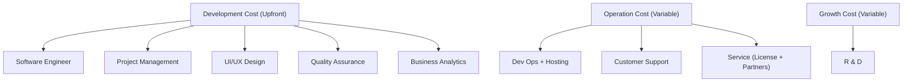

# Business Model + Product Strategy

## context: DBTT for brick and mortar restaurants

- people queuing = people not browsing = less spending than expected
- [P.F. Chang](https://www.pfchangs.com/)
    - chinese restaurant, people usually spend 3-4 hrs to eat cuz dating
    - SG its usually 75 mins
    - Airport branch usually turnover is faster
        - orders are also usually higher since they also order wine
        - high turnover + large expenditure = fast growth.
        - Only possible if people can provide high quality food quickly.
- Cathay building's Mala soup
    - main issue was that clothing will smell like that stall.
    - ultimately the same issue with their business model.
- Johor-Singapore economic zone
    - contract signed or expanding the custom clearance from SG to Johor by 5
    - reason being it takes a while to clear customs, but with this expansion the time will be cut to 10 mins
    - customs also intend to be combined.

---

## How these apply to software products

- Ultimately, the same applies for software.
- Low capital investment, high Up-front Cost with Low Revenue Dependent Variable
- Ultimately, Revenue – Cost of Goods Sold (COGS) = Gross Profit.

All 3 are under COGS.

- Example: Banking Service
    - old system was that insufficient funds charge was present, coulda been solved with code, even had some issue
    - despite all these issues, customers won't probably switch because there was a high switching cost (ie delays to changing, cost incurred etc)

- Unless AI is critical to your business, you don't really need to be at the forefront, just follow the leader.
    - strat in sports, being at the forefront requires a lot of effort.
    - not only need to be second, you also ideally should take over quickly (before the company reaches a second critical mass moment)

### Trust in market leadership

- basically refers to the good will associated with a brand's image.
    - ie Asus, people are still lingering because it used to be reliable.

## Business Model

> [!tip] Business model definition:
> Rationale of how an organization creates, delivers, and captures value by interacting with suppliers, customers, and partners. (⭐)

Just use this framework to understand your business model and how to structure your product.

---

## Software Product Strategy

- Understand your market and your customer.
- how to grow your business and further meet their needs.
- every 1 year theres a small revolution, every 3 years there's a major revolution
    - hence you need to take care of the major IT changes quickly.

### Product competition

- refer to economics ideas
    - close substitutes through direct competition (ie lazada / shopee)

- direct vs indirect competition (ie grab)
    - direct means for the same exact business model (ie gojek)
        - coffee vs coffee
    - indirect means for just a simple need (ie BlueSG, TribeCar)
        - coffee vs tea vs juice

Competitive necessity: its the cost associated from just needing to get revenue.

### Blue ocean Strategy

- basically the market is uncontested because either nobody went into it, or you create new demand and create the ocean.
-

Essay qn: value proposition

- China market, people wear iphone as a accessory and a display of wealth
  
### Product performance management scorecard

Looks at org performance by looking at non-financial measures outside of the typical profit-driven view.

### Product risk

- 