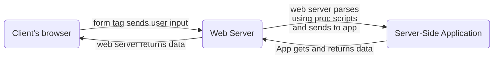

# 02 - WBDV1 (IS113) (HTML Basics)

- Objectives:
    - last week:

        Web concepts: URL, HTTP, DNS server, web server, resources, etc.

        What are they?

        - ▪ Five components of a URL?
        - WAMP/MAMP Server and its installation
            - Document root = where everything is kept for “compiling” your website, sorta like a root folder (its where the www folder is, under C:\wamp64\www)

    This week:

    - How to read and mod HTML code / page content
    - Common HTML tags
        - Lists (ordered / unordered)
        - form stuff
        - formatting main website stuff
        - table stuff
        - images

---

## HTML (HyperText Markup language)

- uses markup tag elements to indicate to your web client how pages should be rendered.
- tag syntax:

### < tag_name [some parameter href]=[value]>

- example: `<a href=”hostname”> stuff </a>`, with a start and end tag.
- note that tags are usually in pairs, to denote the start and end of a tag. (and the end tags are the same as the start, except they have a forward slash before them).
- if they’re standalone, its good practice to just end them with a slash at the end of their tag. (ie ``).

### VS code autocomplete

- VS Code autocompletes your html and creates this:

    ```html
    <!DOCTYPE html> <!--indicates html format for your renderer to know that it should be using html5 -->
    <html lang="en"> <!-- denotes the start of you html script, as well as a default language to interpret it in --> 
    <head> <!-- denotes some precursor stuff before your viewable website content, ie showing stuff like your favicon / website's tab icon -->
        <meta charset="UTF-8"> <!-- to  denote as metadata, that your characters follow the UTF-8 character set.-->
        <meta name="viewport" content="width=device-width, initial-scale=1.0"> <!-- to  denote as metadata, that you want your website -->
        <title>Document</title> <!-- for whatever shows up as your tab name.-->
    </head>
    <body> <!-- to denote your body text, aka the actual rendered website itself.-->
        
    </body> 
    </html>
    ```

## Common HTML Tags

- Ordered / Unordered lists

    ```html
    "for unordered lists"
    <ul>
      <li>Coffee</li>
      <li>Tea</li>
      <li>Milk</li>
    </ul>
    
    "ordered list"
    <ol>
      <li>Coffee</li>
      <li>Tea</li>
      <li>Milk</li>
    </ol>
    ```

- Form tag Syntax

    ```html
    <form action="/test.php" method="post">
    <!--action for relative filepath where your script resides, metho for request type-->
    GET is used when you wanna get data, POST is used when you want to send data for processing.
    ```

- Form options (the not-so-intuitive ones)

    add a name under form options so that their data can be referenced

    - radio for radial options
    - checkbox
        - uses array for its name ie `<input name="color[]" type="checkbox" value="r" checked />`
        - also as seen above, requires both name and value.
    - textarea for a bigger area to dea with, define size with `rows` and `cols`
    - select for dropdowns
        - option for options under the dropdown.
    - hidden for hidden data
    - reset to reset data

    and if you want any check-related ones pre-checked, add `checked` before you close the tag.

    - ie `<input name="color" type="radio" value="r" checked />`
    -
- How to give radial options more room to be selected

    use the `<label for=”tag_id”>tag</label>`

- what &nbsp is
    - its a character entity.

    [Common entities:](https://www.notion.so/Common-entities-1c3eefc08c814f2d92749e99993dfb60?pvs=21)

- how tables are made:

    ```html
    <table>

    <tr>

    <td></td>

    </tr>

    </table>
    ```

    you also get colspan and rowspan for how many rows you wanna have a single cell / td take over.

## Common HTML Tag Wiki

---

## `<!DOCTYPE html>` ⇒ Flags to your browser your HTML format

- for flagging to your browser to interpret your html file as one ***written in the HTML5 format.***
- slapped at the start of your file.

---

## `<html>` ⇒ flags which part of your script is the html

- indicates that whatever’s between the tags is to be read as HTML script, and is meant for website rendering.

---

## `<body>`

- indicates where your website content begins, and is meant for displaying everything your website’s supposed to.

---

## `<head>`

- for marking script thats meant for displaying as the website’s header / content that appears at its tab preview (ie page title and favicon)

---

## `<meta>` ⇒ for some features that concern how your browser should display your content, but doesnt need to be part of your body script

- you get to indicate stuff in your attributes like:
    - charset ⇒ what set of character convention your script follows (ie ascii or UTF-8)
    - name ⇒ for certain finer aspects of your website to modify ie:
        - viewport ⇒ how your website will look like in terms of the dimensions of the window (ie phone-screen sized on a website? but usually its set dynamically based on the `content` attribute, and scales according to your device’s screen width in the first place)

---

## `<title>`

- for marking the actual text of the title.
- usually added under the header tags of the page.

---

## `<ul>, <ol> and <li>` ⇒ for lists

- `<ul>` is for marking a bulleted / unordered list, ie doing `-` in markdown.
- `<ol>`is for marking an ordered list, ie doing `1.` in markdown.
    - use the attribute type = “a / A / 1 / I” for whatever numbering you want.
- `<ul>` is meant to surround `<li>`, which marks the actual text for each bullet point.
- ie code:

    ```html
    <!DOCTYPE html>
    <html>
        <head><title>List Example</title></head>
        <body>List of fruits:
            <ul>
                <li>Apple</li>
                <li>Orange</li>
                <li>Pear</li>
            </ul>
            List of Students:
            <ol>
                <li>Fan Bing Bing</li>
                <li>Kim Jong Un</li>
                <li>Donald Trump</li>
            </ol>
        </body>
    </html>
    ```

    gives:

    

---

## <a> ⇒ Anchor Tag aka the link tag (v impt)

- links shit to somewhere else, can be back to a section in your website (as long as its denoted) or it can link to another website.
- use the `href` attribute to link stuff elsewhere.
- you can also link to other filepaths under your web server (aka route to other pages on your website). ie `<a  href=”./is113/lecture1.pptx”>`

  ### Quick refresher on filepaths: (!important)

    - starting with a `.` in yout filepath ie "./is113/lecture1.pptx” means you start from your own directory
        - the folder you wanna access, in this case its “is113”, is in the same folder that your webpage is on.
        - but by default, you can just start with “is113/lecture1.pptx” instead to achieve the same effect.
    - starting with a `..` in yout filepath ie "../is114/lecture1.pptx” means you start from your parent directory
        - the folder you’re accessing is in your parent folder, the bigger folder that your current file is in, but in the other side.
    - starting with a `/` in yout filepath ie "/is114/lecture1.pptx” means you start from your root folder / Document root.
        - the path you wrote is relative to the base folder containing all your files.

    | . | start from current folder |
    | --- | --- |
    | .. (or however many dots) | start from parent folder |
    | / | start from root |
    | NA | start from current folder |

    - if you set href to:
        - [`http://localhost`](http://localhost) → you go back to your localhost page.
        - all websites need to have http or https if theyre legit links
        - [http://127.0.0.1/whatever](http://127.0.0.1/whatever)_path_afterwards
- another attribute you can use is `target`, and set it to `“_blank”` to open a new page.
- also, you can link to other tags, by giving them a unique value with their `id` attribute, then your href link to “#id_name”
- You can also link to other sections on the same website.

    syntax:

    ```html
    <!DOCTYPE html>
    <html>
    <head><title>My Links Page</title></head>
    <body>
    <a href="#bottom-section">Jump to Bottom Section</a>
    stuff
    <a id="bottom-section">Bottom Section</a>
    </body>
    </html>
    ```

    - by marking a target tag with an `id`attribute to `id_var` (to identify it) and then setting an anchor tag’s `href` attribute to be `#id_var`, you effectively link the 2 tags, and clicking the link will direct you to where the tags with said ID are.
- ie code:

    ```html
    <!DOCTYPE html>
    <html>
        <head><title>List Example</title></head>
        <body>
            This is a
            <a href="http://www.google.com">link</a>
            to the google web site.
        </body>
    </html>
    ```

    gives:

    

    This is a link to the google website.

---

## `` ⇒ standalone tag that if linked to some resource, shows an image

- used for displaying images found at whatever filepath or url the `src` attribute has.
- has other unique attributes relating to image properties ie `width` and `height`.
- needs no ending tag (ie no such thing as `</img>`, but good practice to end with a />)

---

## Body-content tags

- `<h1>,<h2>,<h3>`,etc tags ⇒ for diff levels of headers
- `<p>` to indicate body text of a paragraph
- `<br>` to indicate section breaks to split and make text easier - read by sectioning and separating them
- `<small>` to note small text
- `<pre>` ⇒ for rendering text as is
- HTML entities

- basically sorta like escape keys but for html, to prevent collisions with reserved characters in HTML, like quotations, ampersands etc.
    - escape chars start with bacckslash (\), HTML entities follow syntax of:

    | Call by Entity name | `&*entity_name*;` |
    | --- | --- |
    | Call by Entity number | `&#*entity_number*;`  |

    - ie to display < you can do **`&lt;**` or **`&#60`,** and obviously since names are easier to remember, we usually use the names to call such characters.

### &nbsp; ⇒ non-breaking space, basically makes sure text doesnt get cut off when screen-size changes, by indicating that said text should be grouped together

- Example

    truncated webpages might do v1, which is ugly:

    ```html
    Beer in this store costs $ 
    5
    ```

    so by using `&nbsp;` as such:

    ```html
    <p> Beer in this store costs $&nbsp5</p>
    ```

    your worst case text looks like:

    ```html
    Beer in this store costs
    $ 5
    ```

- Common entities:

    | non-breaking space | &nbsp; | &#160; |  |
    | --- | --- | --- | --- |
    | less than (<) | &lt; | &#60; |  |
    | greater than (>) | &gt; | &#62; |  |
    | ampersand (&) | &amp; | &#38; |  |
    | double quotation mark (”) | &quot; | &#34; |  |
    | single quotation mark (’) | &apos; | &#39; |  |
    | cent (¢) | &cent; | &#162; |  |
    | pound (£) | &pound; | &#163; |  |
    | yen (¥) | &yen; | &#165; |  |
    | euro (€) | &euro; | &#8364; |  |
    | copyright char ( ©️ ) | &copy; | &#169; |  |
    | trademark ( ® ) | &reg; | &#174; |  |

- Another thing that requires this is when you add accents / diacritical marks / weird shit on top of your characters ie $\hat{y}$.

    format it as `<char>&#<diac_ent>;`.

    |  ̀ | a | `a&#768;`| à |
    | --- | --- | --- | --- |
    |  ́ | a | `a&#769;` | á |
    | ̂ | a | `a&#770;` | â |
    |  ̃ | a |`a&#771;` | ã |
    |  ̀ | O |`O&#768;` | Ò |
    |  ́ | O |`O&#769;` | Ó |
    | ̂ | O | `O&#770;` | Ô |
    |  ̃ | O |`O&#771;` | Õ |

---

## `<form>` ⇒ used to create forms and make pages somewhat interactive (by having users be able to enter stuff). ⇒ used to send requests

- effectively allows your user to make their own query to your website’s database or whatever application it works with, get data and return it and render as new information under your website.
- treat it like a tag that works like python’s requests module.



- syntax for form script:

    ```html
    <!DOCTYPE html>
        <html>
            <body>
                <form action="/test.php" method="post">
                </form>
            </body>
        </html>
    ```

## `<form action="/test.php" method="post">`

### action parameter - where to make the request to / send the form’s payload to (as in which script will process the info your user enters)

### method parameter - sets the type of payload being sent and how its formatted

- pick between two common ones, post and get (get to ping for data, post to update data on your DB)

## Intro to protocol-ling (comparing GET and POST) | ([W3Schools](https://www.w3schools.com/tags/ref_httpmethods.asp) ref)

- HTTP is a protocol, but there are different types of payloads that a HTTP protocol can send.
- These different types are known as methods and range from a couple, but the most common ones are get and post.
    - **GET**
    - **POST**
    - **PUT**
    - **HEAD**
    - **DELETE**
    - **PATCH**
    - **OPTIONS**
    - **CONNECT**
    - **TRACE**

GET is used to request data from a specified resource.

Note that the query string (name/value pairs) is sent in the URL of a GET request:

`/test/demo_form.php?name1=value1&name2=value2`

POST is used to send data to a server to create/update a resource.

The data sent to the server with POST is stored in the request body of the HTTP request:

```html
POST /test/demo_form.php HTTP/1.1
Host: w3schools.com
name1=value1&name2=value2
```

- Some comparisons

    | Differences | HTTP.GET | HTTP.POST |
    | --- | --- | --- |
    | Purpose | GET is used to retrieve info, sorta like a query | POST is used to send info to a resource, either to add or update the info there. |
    | Payload  | query itself is embedded in the URL of your request, very obvious | payload is hidden in the HTTP request content itself. |
    | Refreshing your page / doing shit | nothing bad will happen, data just gets retrieved again | request will be resubmitted |
    | Cacheability | request can be cached (stored away temporarily by your browser) | request cant be cached |
    | can bookmark? | Yes (so we just store it like a link) |  No |
    | Encoding Type | in URL | part of HTTTP request, uses multipart encoding for binary data |
    | History | its a URL | nope |
    | Size | limited by URL length of 2048 characters | No restrictions |
    | Data=types allowed | ASCII only | No restrictions, even binary data is ok |
    | Security / Visibility | literally can see what you queried in your URL, not very secure. therefore, don’t use it for any sensitive data. | Somewhat safer since nothing will be stored in your history, payload i also not visible from URL. |

---

## Form Components

- the rest of this segment will just be what people can use to create forms.

    This includes:

    - Text Fields
    - Submit Buttons
    - Reset Buttons / clear form buttons
    - Checkboxes
    - Radio buttons / Radial buttons
    - Password fields
    - Hidden Fields
    - Dropdown Lists
    - Text Areas
    - Labels

    

---

## `<input>` ⇒ used together with forms (nested inside) to prompt user input

- you have access to a couple of attributes like
    - `name` to identify your field for when you send your form to your server.
    - `value` to set a default value, and
    - `size` to show how big your field is (in px).
- using the `type` attribute,  you can pick what comes out from the above droplist. (possible combos below)

    | `type = "<var>"` | input type | desc |
    | --- | --- | --- |
    | `text` | Text Fields | for entering text |
    | `submit` | Submit Buttons | button triggers request submission.using the `value` attribute here changes what the button’s text says, while using the `name`attribute just acts like an identifier (thats not `id`). |
    | `password` | Password fields | for entering text like a password, and obsecuring it visually |
    | `radio` | Radio buttons / Radial buttons | for listing options of single-select choices, only one can be checked at a time. user input will auto-add the `checked` attribute to whichever is the active user’s selection, and only 1 can exist in that form at any time. ANYlso, put them under the same name to make them single-select. |
    | `checkbox` | Checkboxes | Creates a checkbox. Also refers to the `checked` attribute.The square brackets are meant to accept multi-select values as arrays for processing in php. |
    | `hidden` | Hidden Fields | for info that you need to send as part of your payload, but not for your user to know (ie session ID) |
    | `reset` | Reset Button | clears all fields in your form and restores everything back to their default values, doesn’t send any form data over to your web server. |

### Interacting with requests

- basically, use name to assign like a label for your data that you send.
- for multiselect stuff ie checkbox input or

---

## `<label>` ⇒ for accessibility, indicating selections made by selecting elements instead of the radial buttons themselves / associates interactions with a form component to another component (ie links text selection to button)

- ie given code:

    ```html
    <!DOCTYPE html>
    <html>
        <body>
            <form>
            Your preferred Color:
                <input name="color" type="radio" value="r" checked />Red
                <input name="color" type="radio" value="g" id="color_g" />
    
                    <label for="color_g">Green</label>
    
                <input name="color" type="radio" value="b" />Blue
            </form>
        </body>
    </html>
    ```

- and linking the radial option’s `id` attribute to the label using the label’s `for` attribute, you basically let users click the word green to select the radial instead of the radial itself

---

## `<textarea>` ⇒ creates a textbox that allows multi-line entry

- again, has access to the `name` attribute
- also can specify the size based on number of string chars, ie setting values for the `rows` and `cols` attribute

---

## `<select [`multiple`]>` →  `<option>` ⇒ for creating dropdown lists

- Syntax:
    - use the `select` tag to indicate that you want a dropdown list
        - default state for select is just to have a textbox where indicated.
        - afterwards, between your select tags just indicate some text as your option.
        - using the `multiple` modifier will let you select multiple options under that form.

    ```html
    <!DOCTYPE html>
    <html>
        <body>
            <form>
            My favorite colors:
                <select name="color[]" size="3" multiple>
                    <option value="R" selected>red</option>
                    <option value="G">green</option>
                    <option value="B" selected>blue</option>
                </select>
            </form>
        </body>
    </html>
    ```

- note that for PHP, your post request will be sent to PHP and the variable will be stored as an array like `stuff[]`
    - however, note that you still retrieve using only the name ie `$_GET["stuff"];`, and best to assign to a separate variable.

---

## `<table>` → `<tr>` (Table Row) → `<th>` (Table Header) → `<td>` (Table Data)

- all of these tags need to be indicated with closing tags.
- create a table with `<table>`
    - Mark each table row with `<tr>`
        - Mark a table header for 1 col with `<th>`
        - mark actual Table data for 1 col with `<td>`
- with the `border` attribute and `style` attribute (or tag), you can add color to your stuff.
    - ie with style tags

        ```html
        <style>
            table{border: 1px solid black;}
            th,td{border: 1px solid black;}
        </style>
        ```

### Merging cells

- you  can use `colspan` and `rowspan` to merge cells across rows and columns respectively.
    - for OCD, `style` > `“text-align:<alignment>”`.

And best practice is to indent everything so that you know what is at what level.

### Example

Input:

```html
<!DOCTYPE html>
<html>
    <body>
        <table>
            <tr>
                <th>Purpose</th>
                <th>Telephone Number</th>
            </tr>
            <tr>
                <td>Fire/Ambulance</td>
                <td>995</td>
            </tr>
            <tr>
                <td>Police</td>
                <td>999</td>
            </tr>
        </table>
    </body>
</html>
```

### Exercise Answer

- do:

    ```html
    <!DOCTYPE html>
    <html lang="en">
    <head>
        <meta charset="UTF-8">
        <meta name="viewport" content="width=device-width, initial-scale=1.0">
        <title>Document</title>
    </head>
    <body>
        <table border = "1">
            <tr>
                <th> </th>
                <th> 8.30 - 10.00</th>
                <th>10.15 - 11.45</th>
                <th>12.00 - 1.30</th>
                <th>1.45 - 3.15</th>
                <th>3.30 - 5.00</th>
                <th>5.15 - 6.45</th>
            </tr>
            <tr>
                <th>
                    Monday
                </th>
                <td colspan = "2" style = "text-align:center"> IS 113</td>
                <td></td>
                <td></td>
                <td></td>
                <td></td>
            </tr>
            <tr>
                <th>
                    Tuesday
                </th>
                <td></td>
                <td></td>
                <td></td>
                <td colspan="2" style = "text-align:center"> IS 202</td>
                <td></td>
            </tr>
            <tr>
                <th>
                    Wednesday
                </th>
                
                <td></td>
                <td>MGMT 226</td>
                <td></td>
                <td></td>
                <td></td>
                <td></td>
            </tr>
            <tr>
                <th>
                    Thursday
                </th>
                
                <td></td>
                <td></td>
                <td></td>
                <td></td>
                <td>POSC 001</td>
                <td></td>
            </tr>
            <tr>
                <th>
                    Friday
                </th>
                
                <td></td>
                <td></td>
                <td></td>
                <td></td>
                <td></td>
                <td></td>
            </tr>
        </table>
    </body>
    </html>
    ```

---

# Random VS Code Emmet stuff

---

Whatever you want as a tag, you can just type it first (ie a) then tab to autocomplete.

duplicate line by doing alt shift down or up (to copy that direction)

add new line below code with ctrl + enter

rnadom thing, doing a nested ol:

- doing an OL outside of a list item and one inside a list item has virtually no diff.

    ```html
    <ol>
        <li>item1</li>
        <li>item2</li>
        <li>item3</li>
                <ol>
                    <li>subitem1</li>
                    <li>subitem2</li>
                    <li>subitem3</li>
                </ol>
    </ol>
    
    <!-- same as -->
    <ol>
        <li>item1</li>
        <li>item2</li>
        <li>item3</li>
            <li>
                <ol>
                    <li>subitem1</li>
                    <li>subitem2</li>
                    <li>subitem3</li>
                </ol>
            </li>
    </ol>
    ```

[cheatsheet-a5.pdf](cheatsheet-a5.pdf)

# Revision Test (W1)

- How does a browser retrieve a website's IP address using awebsite's IP address using a hostname?
    - sends a request via the HTTP Protocol to the DNS Server, which will ping the hostname’s IP back in the contents of its request body  / resolve the hostname.
- What are the three main components of the HTTP request structure?

    all start with Request ___ .

    - Request Line
        - for http, it has the format `<method> <Request-URI> HTTP-Version CRLF`
        - URI stands for Uniform Resource Identifier → for indicating the filepath of your resource on your webserver
        - CRLF is just a line terminator, meant to indicate the end of the request line
    - Request Header
        - has the syntax `<header>: <value>`
        - for passing additional info about the request line, ie stuff about the client that may affect whats to be sent back.
    - Request Body
        - usually after all the stuff above, meant to be read as the actual payload of stuff that the processing engines need to read ie form data. (ie for PHP script to read, or for XML to deal with.)

    

    - refer to:
        - [TEST: Most important features about HTTP: (4 of them)](https://www.notion.so/TEST-Most-important-features-about-HTTP-4-of-them-5d4de5650ff84ffe999294ff5813893b?pvs=21)
        - [HTTPS request-response text sample:](https://www.notion.so/HTTPS-request-response-text-sample-3f62114bdfdd46abbd12b7f56e999e0d?pvs=21)

    ---

- What is the default port number used by HTTP when it is omitted from a URL?
    - default port is 80 (if port is omitted).
    - 8080 - for webservers
    - 443 - standard port for https
    - 20 and 21 - FTP
    - subqn: 5 parts of a URL (universal resource locator):
        - protocol / request scheme
        - hostname
        - port
        - path
        - query
- How do HTTP and HTTPS protocols differ, and why might a web server use various ports for these services?
    - HTTPS is just HTTP but the data is encrypted, used for secure data transfer (ie password submissions)
- What HTTP status code range indicates client errors, and which specific code implies resource not found?
    - 400 range is for client-raised errors. (ie client machine was the one that flagged the error)
    - 404 not found.

  ### Status Codes (ie 200, error 404)

    - numbers to indicate anything unique about your request.

    | 1XX | Informational request |
    | --- | --- |
    | 2XX | Successful ping |
    | 3XX | Redirected request |
    | 4XX | Client-side raised an Error |
    | 5XX | Server-side raised an Error |

- How does accessing a website via localhost differ from accessing it through a live DNS-resolved domain name?
    - if [localhost](http://localhost) is called, DNS reserves the port number and uses a separate procedure to make sure the IP of the client machine is returned.
    - also, your machine auto-detects and just knows to route back to you.
